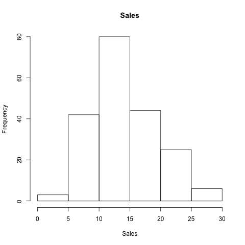
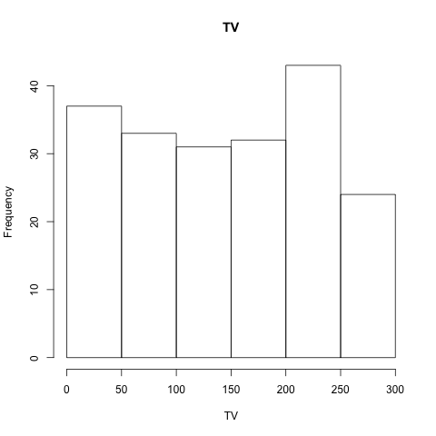
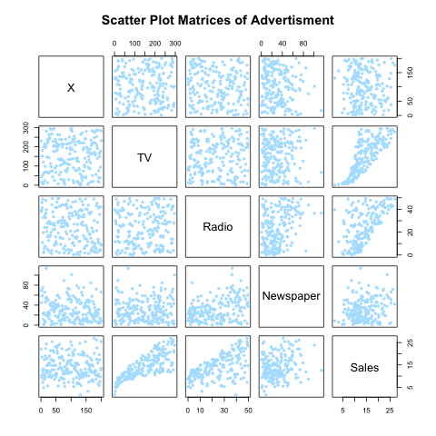
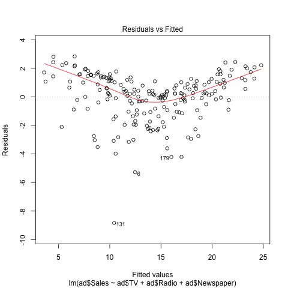

##Abstract

Fall 2016 Statistics 159, Reproducible and Collaborative Statistical Data Science, homework three introduced multiple regrssion analysis. This report utilized the Advertising data that was provided to reproduce the results displayed in Chapter 3.1 and 3.2, _Multiple Linear Regression_, of the text book, _An Introduction to Statistical Learning_ written by Gareth James, Daniela Witten, Trevor Hastie and Robert Tibshirani. The report focuses on the regression relationships of values `TV`, `Radio`, and `Newspaper`on `Sales`.

##Introduction

The overarching goal of this homework is for the students to get familiarized with multiple linear regression, a powerful tool to analysize data. Rather with only one predictor in simple linear regression, multiple regression analysis allows us to examine multple predictors. Through simple linear regression, we can run three different and separate regressions each using one of the three `Advertising` mediums as a predictor. However, with this type of approach there is no way to accurately predict of sales given three different levels of predictors, since each of the budgets is associated with a separate regression equation. In addition, each individual regression ignores the other two regressions in computing the regression coefficients. Thus extending the simple regression model is the best way to solve the problem.

##Data

The Advertising data that used in this report was provided through [this data set](http://www-bcf.usc.edu/~gareth/ISL/Advertising.csv), which is part of the textbook, _An Introduction to Statistical Learning_ written by Gareth James, Daniela Witten, Trevor Hastie and Robert Tibshirani. The data represent `Sales`  through three different media: `TV`, `Radio`, and `Newspaper`, in 200 different markets. `Sales` data represents the total amount of profit, in thousands of units. While `TV`, `Radio`, and `Newspaper` reflect the cost, in thousands of units, in total spent on three different mediums of advertisemen. We first examined each the individual variables, for example: 






##Methodology

Relationship between two variables are usually more complex than linear model, thus multiple regression is the best way to predict the relationship between variables. The equation for multiple regressio is the following, $$ Y = \beta_{0} + \beta_{1}X_{1} + \beta_{2}X{2} + \cdots + \beta_{p}X{p} + \epsilon $$. This `Advertising` report utilizes the model as following: $$ Sales = \beta_{0} + \beta_{1}TV + \beta_{2}Radio + \beta_{3}Newspaper + \epsilon $$. Then we further looked at other values such as R-squared, F-statistics, residual standard error of the multiple regression analysis. _X_ is the _j_th predictor and $\beta_{j}$ represents the correlation between the predictors and the response. $\beta_{j}$ also can be interpreted as the _average_ effect on _Y_ of a one unit increase in _X_. Thus positive $\beta$ value means that there is an positive correlation between the two focuesed variable. In addition to how strong the correlation is, _significance_ is also another important aspect in determining the fit of the model. 

From a simple linear regression example between `Sales` and `TV`

\begin{equation}
Sales \approx \hat{\beta}_0 + \hat{\beta}_1 TV
\end{equation}

In order to accurately estimate $\hat{\beta}_0$ and $\hat{\beta}_1$ that fit our linear model, we needed to use the 200 samples that are given in the data. Ultimately, our goal is to fine the _closeness_ between $\hat{\beta}_0$ and $\hat{\beta}_1$ and _n_ = 200 different markets. We have to find an intercept of $\hat{\beta}_0$ and a slope $\hat{\beta}_1$ such that the resulting line is as close to the _n_ = 200 data points. Same goes for the purpose of this multiple regression paper. Other values that we also look at in order to determine significance are R-squared, F-statistics, and residual standard error. 

##Results

Firstly, we can look at the scatterplot matrix between the relationships between all the variables and observe how accurate the model actually is.



Through the scatterplots in the above plot, we can grasp an idea of how each predictor interact with the target. Whether it has a positive or negative correlation reflect how all the scatte data points are presented in each plot. Then we can look at individual plot. Here is an coorelation matrix that show each predictor and target correlation in quantitative form.

```{r echo = FALSE}
load("../data/correlation-matrix.RData")
library(pander)
pander(matrix_cor, caption = "Correlation Matrix")
```

Looking at the correlation table, one can see that there is no apparent relationship between all the predcitors, such as `TV` and `Newspaper`. However there are strong correlation between `Sales` and the three advertising mediums. Let's look at them closely individually.


After the simple linear regression between `Sales` and each of the three mediums of advertisement `lm(Sales ~)`, we computed the multiple regression of all predictors and the target. Here is the quantitative form of the regression analysis.

```{r echo = FALSE}
load("../data/regression.Rdata")
library(pander)
pander(regression, caption = "Multiple Regressions on Sales")
```

Additionally, we can look at the other values such as R-squared, F-statistics, and residual standard error to determine how "fit" the model is. Looking at the table above, we can see that there is a significance for the relationship between `TV` and `Sales` and `Radio` and `Sales`, due to the small p-values that are shown. However `Newspaper` and `Sales` do not have a significant relationsihp because the large p-value. The $\beta$ values for both `TV` and `Radio` are positive and quite small. We can further look into other statistics.


```{r xtable, results='asis', echo = FALSE}
source("../code/functions/regression-functions.R")
library(xtable)

r_2 <- r_squared(regression)
f <- f_statistic(regression)
rse <- residual_std_error(regression)
stat <- data.frame(Quantity = c("R-squared", "F-statistic", "Residual Standard Error"), Value = c(r_2, f, rse))
print(xtable(stat,  caption = "Multiple Regression Statistics"), comment = FALSE, caption.placement = 'top', include.rownames = FALSE)
```

Looking at the statistics, we can see that our model does not really "fit" with the data. Here is an visual representation. 



##Conclusions

In conclusion, multiple regression performs more indepth compare to simple linear regression. Through multiple regression analysis, we were able to use multiple predictors. To answer the questions that are listed on page 75 in the textbook, we had to look through the report as a whole. All the predictors help to explain the response because in order to get an accurate regression you need to take in account the entire data set. The model fits relatviely well with the data. Looking at the different values such as R^2, F-statistics, and RSE values, we can conclude that the prediction is relatively accurate. 

